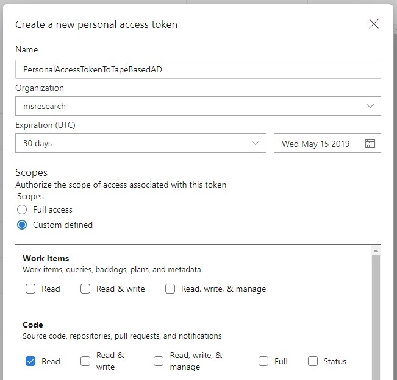

<!-- TOC -->

- [Tape-based AD Project](#tape-based-ad-project)
    - [Installation](#installation)
    - [Usage](#usage)
        - [Calculate gradient](#calculate-gradient)
    - [API](#api)

<!-- /TOC -->

# Tape-based AD Project

## Installation
In Julia REPL, press `]` to enter the `pkg`-mode, whose prompt looks like:

<tt>
<font color="dodgerblue">(xxx) pkg></font>
</tt>

Then execute:
```cmd
add https://dev.azure.com/msresearch/JPLProject/_git/ADPrototype#ba7a6d2e
```

On Windows, a dialog box titled _Windows Security_ will pop up, asking for your credentials:


The expected credential here is actually the **personal access token**. To create one, please go to
<https://dev.azure.com/msresearch/_usersSettings/tokens> and click _New Token_:


In the _Create a new personal access token_ dialog box, give it an easy-to-identify name. And
most importantly:
1. Change _Organization_ to **msresearch**;
1. Change _Scopes_ to **Custom defined** and check **Code/Read**.



Then click _Create_ and a new personal access token will be generated for you.

> Note:
>
> After the web page showing the token gets closed, we have no way to retrieve that token again,
> unless we generate a new one or re-generate it. If we want to reuse the token, we need to
> record the token somewhere else.

Then provide your work email address and the newly generated personal access token as _User name_ and _Password_ respectively in the _Windows Security_ dialog box:


> Note:
>
> After the installation finishes, we can press `Backspace` to exit the `pkg`-mode and return to
> the normal Julia REPL.

## Usage

### Calculate gradient
```julia
julia> using ReverseAD

julia> f(x, y) = 4x * y
f (generic function with 1 methods)

julia> val, grads = gradient(f, 2, 3)
(24, [12.0, 8.0])
```

## API
```julia
function gradient(func, inputs...)::Tuple{Real, Vector{Real}}  
```
**Public** in the module `ReverseAD`.

This function is to calculate the gradient of some function at a given point.

Parameters:
1. `func`: a callable whose gradient will be calculated. `func` must return a scalar value. Valid inputs include normal functions, lambda functions and callable objects.
    
    The implementation of `func` **CANNOT** use array-related arithmetic functions.

1. `inputs`: arguments to `func`. Every element must be a `Real`.

Returns:

An instance of `Tuple{Real, Vector{Real}}`.

1. The first element is a scalar. It is the result of evaluating `func` with `inputs`.

1. The second element is the gradient of `func` at the point of `inputs`.
